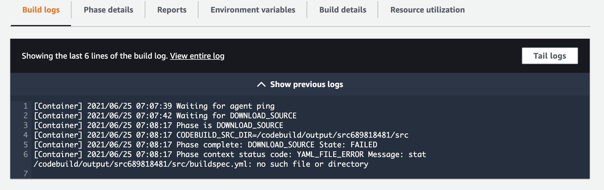
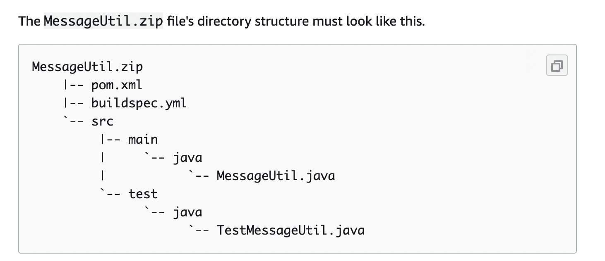
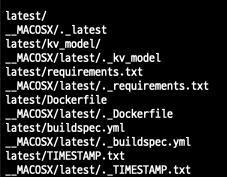
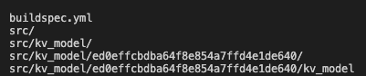
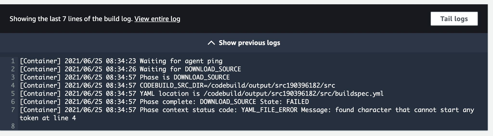
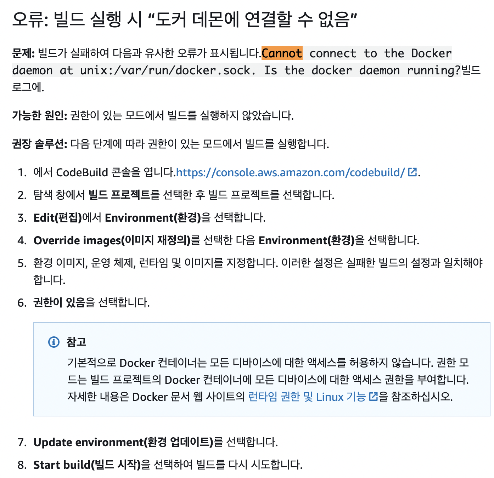

#### CodeBuild

- Source를 빌드하고 그 결과물을 저장하는 역할
  - GitHub
  - CodeCommit
  - ECR
  - S3


#### CodePipeline

- Build 이후에 Tasks 진행

`ECR` Docker image Push => `CodeBuild`가 build => `CodePipeline`이 ECS에 배포함


Reference

> https://medium.com/pablo-perez/how-to-automatically-deploy-new-docker-image-updates-in-an-ecs-service-being-the-dockerfiles-in-742d44a36d32

> https://cobain.me/2020/04/29/ECS-CodePipeline-CICD.html

> https://cherrypick.co.kr/deploy-ecs-fargate-with-aws-codepipeline/

> https://yunhookim.tistory.com/23


### Take 1

Source: ECR Image_Tag(TIMESTAMP) > Build> Deploy

- 새로운 Docker Image가 올라가면 Deploy는 진행되지만, 이미지가 바뀌지 않음

- 이미지 변경을 자동화하려면, 새로운 ECR repo에 `latest`를 태그로 하는 이미지 업로드 해야함
- Source: ECR Image_latest > Build> Deploy


### Take 2

Source: S3 > Build> ECR push> ECS pull Image&Deploy

- Build를 위한 buildspec.yml을 S3에 zip으로 같이 업로드 해야함
- buildspec에서 ECR에 TIMESTAMP를 태그로 한 이미지를 업로드 하기 위해 TIMESTAMP 변수를 전달 받아야 함
- Airflow DAG 실행 시 저장 된 시간을 기록한 TIMESTAMP.txt를 다른 docker 이미지 빌드 소스코드들과 zip으로 압축하여 S3에 업로드하기


#### CodeBuild



```
[Container] 2021/06/25 07:08:17 Phase context status code: YAML_FILE_ERROR Message: stat /codebuild/output/src689818481/src/buildspec.yml: no such file or directory
```


> https://acloud.guru/forums/aws-certified-devops-engineer-professional-2019/discussion/-Lny6zn0DGjsj_1UCP_J/Does%20code%20build%20accept%20source%20file%20other%20than%20.zip%20format%3F

> https://docs.aws.amazon.com/codebuild/latest/userguide/getting-started-cli-upload-source-code.html

CodeBuild source를 S3로 쓰기 위해서는 S3 bucket 안에 zip파일로 압축된 소스코드와 buildspec.yml을 업로드해야 함. 이때 중요한 점은 zip 파일 root 디렉토리(최상위 경로)에 buildspec.yml이 위치해야 한다는 것.




하지만 일반적인 압축 방식으로 바탕화면에서 바로 압축을 하면 root가 아닌 곳에 위치함을 아래 명령어로 확인

```
$ vi latest.zip
```




따라서 CMD 창에서 zip 명령어로 문제 해결!

```
# 압출할 파일들이 있는 폴더 위치에서
# -r: 모든 파일 및 디렉토리(./*)를 zip으로 압축
$ zip -r latest.zip ./*
```

```
# 파일 경로 찾기
$ find . -name 파일명  
```






```
[Container] 2021/06/25 08:34:57 Phase context status code: YAML_FILE_ERROR Message: found character that cannot start any token at line 4
```


- yml 파일은 Tab을 인식하지 못하는 문제에서 발생=> 탭 대신 스페이스바(공백 2개)로 수정

> https://nirsa.tistory.com/127


- Backtic(백틱의 문제)

```
# 1차
env:
  variables:
    TIMESTAMP: "`cat TIMESTAMP.txt)`"  # `cat TIMESTAMP.txt`

# 2차
TIMESTAMP: "$(cat TIMESTAMP.txt)"  # $(cat TIMESTAMP.txt)
```

- env variables에는 실행파일로 변수 생성할 수 없음(문자열 변수만 사용가능)

```
pre_build:
  commands:
    - TIMESTAMP=`cat TIMESTAMP.txt`
```


```
cannot connect to the docker daemon at unix:///var/run/docker.sock. is the docker daemon running?
```



=> AWS 공식문서 참조 docker build 수정에서 previliged 체크하기


- Build/Push 에러

```
# buildspec.yml

  build:
    commands:
      - docker build -t keyword-dev:$TIMESTAMP .
      # 이 부분 꼭 추가해주어야 함! ECR에 올라간 이미지에 tagging하기
      - docker tag keyword-dev:$TIMESTAMP 262429377270.dkr.ecr.ap-northeast-2.amazonaws.com/keyword-dev:$TIMESTAMP      

  post_build:
    commands:
      - docker push 262429377270.dkr.ecr.ap-northeast-2.amazonaws.com/keyword-dev:$TIMESTAMP
```

```
# buildspec.yml

  build:
    commands:
    	# 이미지 빌드 시 tagging 같이 해주기
      - docker build -t 262429377270.dkr.ecr.ap-northeast-2.amazonaws.com/keyword-dev:$TIMESTAMP .
      
  post_build:
    commands:
      - docker push 262429377270.dkr.ecr.ap-northeast-2.amazonaws.com/keyword-dev:$TIMESTAMP
```

