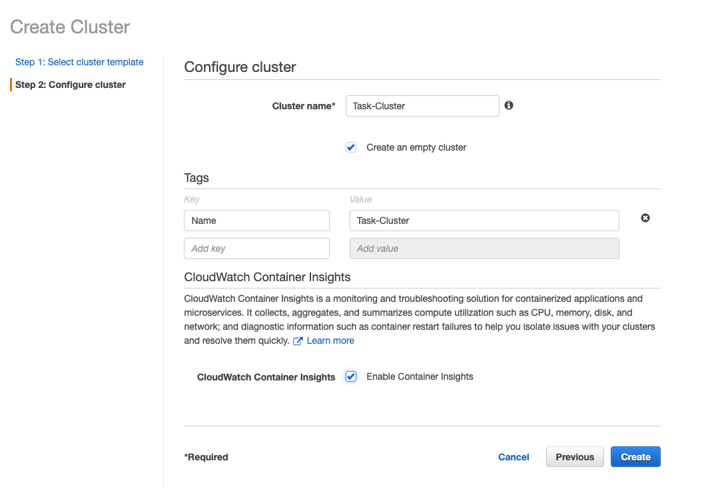
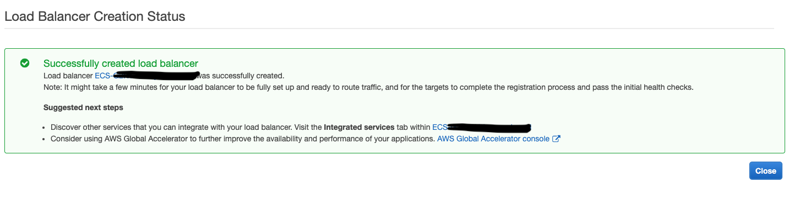
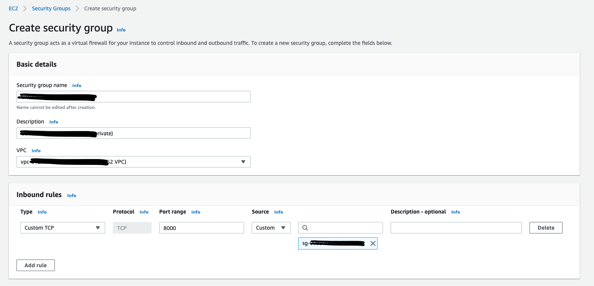
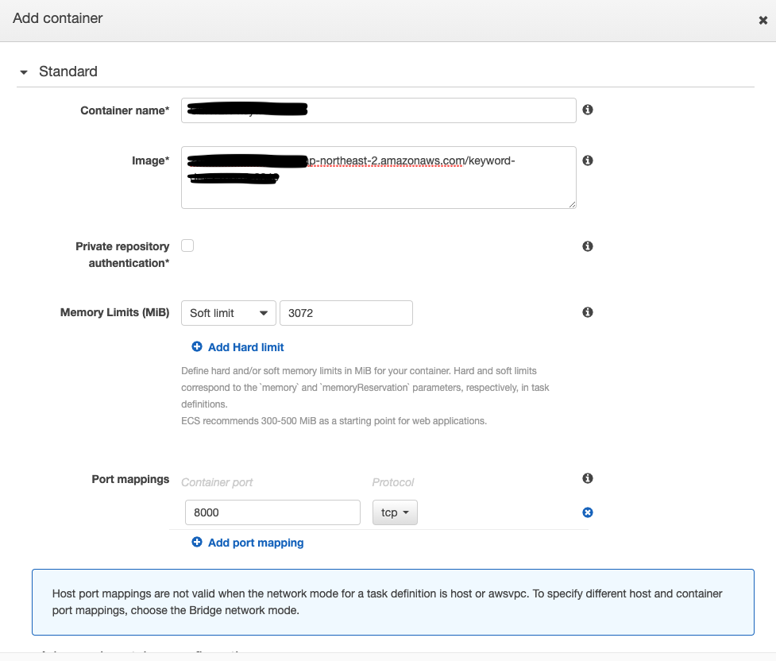
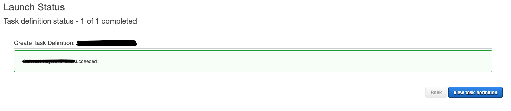
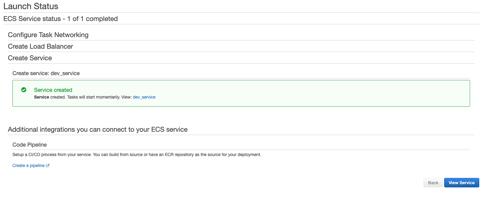
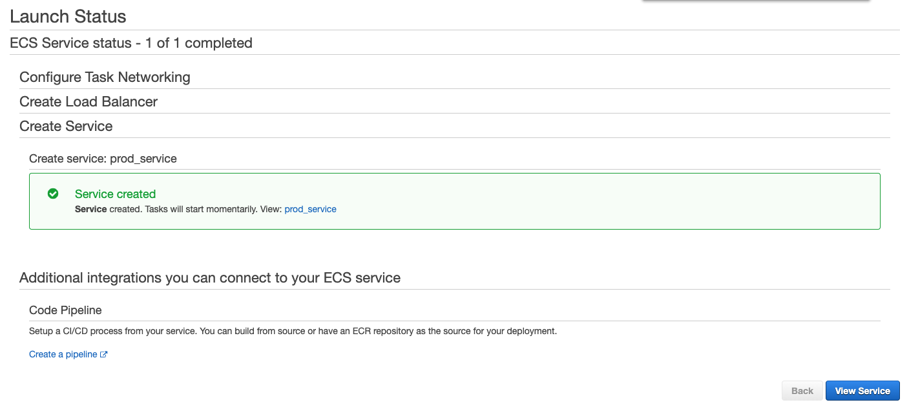

## Cluster

EC2 Linux + Networking> Create an empty cluster> Tag 입력

##  Load Balancer

#### Dev/Prod

1. Application Load Balancer Create> Name입력> Scheme: internet-facing> Listeners: HTTP/80> Availability Zones: VPC 선택> Tag 설정

- Listeners
  - 해당 Load Balancer에서 사용할 Security Group 생성 시 추가했더 IP의 Port 번호를 추가해주어, 요청이 들어오는 Port를 듣고 허용을 해 줄 수 있음

2. Security Settings: Next 누르기

3. Security Group 선택/ 새로 생성하기(Load Balancer용으로!)

4. Configure Routing

   - TargetGroup
     - New target group> Name> Target type:IP(Fargate)/ Inatance(EC2)> Port: 8000

   - Health checks
     - ex) Path설정: Flask app.py에 health 함수에서 쓰인 @app.get("/") 데코레이터 URL 주소와 맞춰줄 것!

## Security Group

Security group name> VPC 선택>  Inbound rules> Outbound rules:`All`> Tags 설정

- Inbound rules: 요청이 들어오는 `특정 IP`, `특정 Port`만 허용
- Outbound rules: 외부로 요청을 하는 IP 모두 허용

### Load Balancer Security Group

#### Dev(Public)

- Security group name: `LB-Dev`

- Inbound rules(**개발 시 직접 접속 확인 용도**)
  - `회사 IP:80`
  - `nodered IP:80`

#### Prod(Private)

- Security group name: `LB-Prod`

- Inbound rules(VPC 내 private IP 주소들은 A를 통해서만 접속 가능!)

  - `A IP:80`

  - `Service IP:80`

    

### Target Security Group

#### Dev(Private-Target Group: Fargate)

- Security group name:`Target-Dev`

- Inbound rules(Security Group Chaining)

  - `LB-Dev:8000`

  => Load Balancer Security Group(내부에 적힌 IP X)을 쓰고 있는 Load Balancer를 사용하는 것.

  => 이를 Load Balancer가 쓰고 있는 Security Group을 사용함으로써 Security Group Chaining이라고 함.

#### Prod(Private-Target Group: Fargate)

- Security group name:`Target-Prod`

- Inbound rules(Security Group Chaining)

  - `LB-Prod:8000`

  => Load Balancer Security Group(내부에 적힌 IP X)을 쓰고 있는 Load Balancer를 사용하는 것.

  => 이를 Load Balancer가 쓰고 있는 Security Group을 사용함으로써 Security Group Chaining이라고 함.

##  Task Definition

### Dev

FARGATE> Task Definition Name: keyword-dev> Task Role 비워두기> Network Mode 자동 설정> Task execution IAM role 자동 설정> Task size: Task memory 4GB/ Task CPU 2 vCPU> Container Definition> Tags: Key=Name/ Value=keyword-dev

- Task Role
  - AWS 서비스가 다른 AWS 서비스에 접근할 수 있는 권한을 주는 것(S3를 사용하지 않기 때문에 빈칸으로 두기)
  - Roles가 모여서 Policy를 이루는 것

- Container Definition

  - Container name> Image(ECR 이미지 URI 복사)> Memory Limits: 1024*3=3072> Port mappings: 도커 컨테이너 실행 port(8000) 입력> Docker LABELS: Key=Name/ Value=keyword-dev

  

### Prod

FARGATE> Task Definition Name: keyword-prod> Task Role 비워두기> Network Mode 자동 설정> Task execution IAM role 자동 설정> Task size: Task memory 4GB/ Task CPU 2 vCPU> Container Definition> Tags: Key=Name/ Value=keyword-prod

- Task Role
  - AWS 서비스가 다른 AWS 서비스에 접근할 수 있는 권한을 주는 것(S3를 사용하지 않기 때문에 빈칸으로 두기)
  - Roles가 모여서 Policy를 이루는 것

- Container Definition

  - Container name> Image(ECR 이미지 URI 복사)> Memory Limits: 1024*3=3072> Port mappings: 도커 컨테이너 실행 port(8000) 입력> Docker LABELS: Key=Name/ Value=keyword-prod

## Service

Launch type: FARGATE(Task Def. 과 동일)> Task Definition: 생성한 것 선택> Cluster> Service name> Number of tasks> Min/Max healthy percent: 100/200> Deployment circuit breaker: Enabled with rollback> Deployment type: Rolling update> Propagate tags from: Service> Tags 설정

### Dev

#### Step 1

Launch type: FARGATE(Task Def. 과 동일)> Task Definition: 생성한 것 선택> Cluster> Service name> Number of tasks:2> Min/Max healthy percent: 100/200> Deployment circuit breaker: Enabled with rollback> Deployment type: Rolling update> Propagate tags from: Service> Tags 설정

- Number of tasks: 3
  - Service 내 Target Group에 몇 개의 task를 실행할 지에 대한 task 복제 개수
  - Load Balancer로 부하분산을 하기 위해 몇개의 task로 데이터를 전달할지에 대한 설정 값
- Min/Max healthy percent
  - Task를 배포할 때, 몇 개의 task를 최대한으로 띄우고 기존에 실행 중인 task를 죽이고 대체하는지에 대한 설정값
  - Ex) Number of tasks가 2개일 때 Min/Max를 100/200으로 두면, 기존2+신규2 총 4개의 Task를 실행하고 기존 Task를 종료하여 Min 2개를 계속 유지하는 방법

#### Step2

Cluster VPC 선택> Subnets: Public(개발) 전체 선택> Security Group 선택> Load balancing: Application Load Balancer 선택> Load Balancer name 선택> Container to load balance: Add to load balancer> Target group name: 선택

### Prod

#### Step 1

Launch type: FARGATE(Task Def. 과 동일)> Task Definition: 생성한 것 선택> Cluster> Service name> Number of tasks:3> Min/Max healthy percent: 100/200> Deployment circuit breaker: Enabled with rollback> Deployment type: Rolling update> Propagate tags from: Service> Tags 설정

#### Step2

Cluster VPC 선택> Subnets: Private(운영) 전체 선택> Security Group 선택

