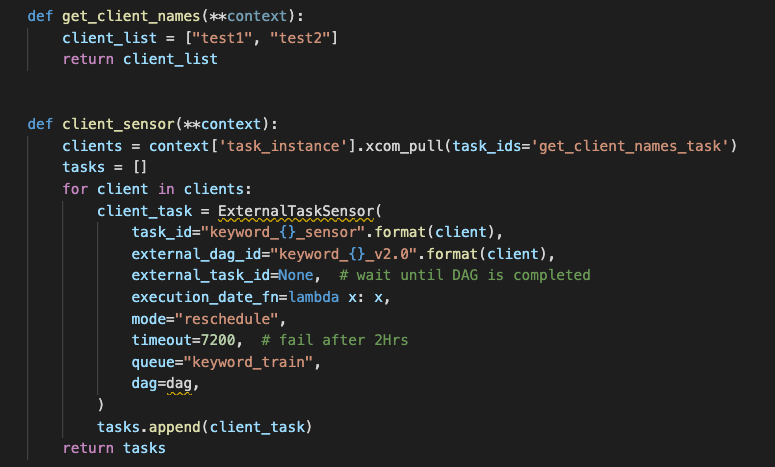
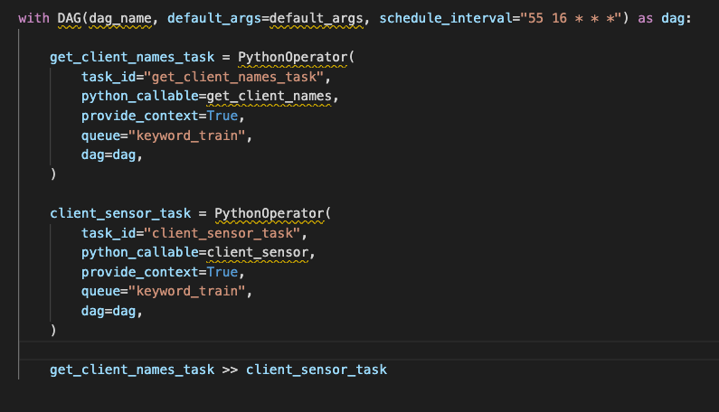
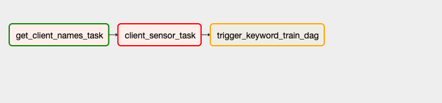
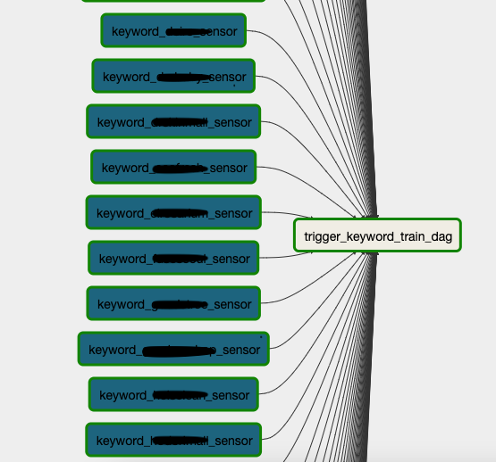

- ExternalTaskSensor는 무조건 해당 dag의 스케줄 시간이 정확히 맞는 run만 sensing 한다.

https://uiandwe.tistory.com/1302


- with open yaml 파일 할 때 한글 인코딩을 적용해 주어야 함
  - 계속 up_for_retry와 queue를 반복함.
  - timeout failed도 적용되지 않고 멈춰있음


- task_instance.com_pull은 def에서 적용시켜줄 것
- string으로만 return 받을 수 있음

```
clients = "{{ task_instance.xcom_pull('get_client_names_task', key='return_value') }}"
clients = task_instance.xcom_pull(task_ids='get_client_names_task')
```

```
name 'task_instance' is not defined
```


### 1. task들 생성 X



```python
from airflow import DAG
from airflow.operators.python_operator import PythonOperator
from airflow.operators.sensors import ExternalTaskSensor

# 함수 생성
def get_client_names(**context):
    client_list = ["test1", "test2"]
    return client_list


def client_sensor(**context):
    clients = context['task_instance'].xcom_pull(task_ids='get_client_names_task')
    tasks = []
    for client in clients:
        client_task = ExternalTaskSensor(
            task_id="keyword_{}_sensor".format(client),
            external_dag_id="keyword_{}_v2.0".format(client),
            external_task_id=None,  # wait until DAG is completed
            execution_date_fn=lambda x: x,
            mode="reschedule",
            timeout=7200,  # fail after 2Hrs
            queue="keyword_train",
            dag=dag,
        )
        tasks.append(client_task)
    return tasks
```



```python
# DAG 생성
with DAG(dag_name, default_args=default_args, schedule_interval="55 16 * * *") as dag:

    get_client_names_task = PythonOperator(
        task_id="get_client_names_task",
        python_callable=get_client_names,
        provide_context=True,
        queue="keyword_train",
        dag=dag,
    )

    client_sensor_task = PythonOperator(
        task_id="client_sensor_task",
        python_callable=client_sensor,
        provide_context=True,
        queue="keyword_train",
        dag=dag,
    )

    get_client_names_task >> client_sensor_task 

```

task들을의 리스트 자체를 task dependency에 추가하려고 했지만, task 리스트들이 만들어지지 않음.




### 2. DAG name 파싱해서 고객사 sensor task 만들기

```
def get_client_names(**context):
    dir = r"../G2R12N-DAGS/keyword"
    files = os.listdir(dir)
    exclude = [
        "keyword_train.py",
        "keyword_dag_dependency.py",
        "keyword_dag_dependency_test.py",
    ]

    clients = []
    for file in files:
        if "keyword_" in file and file not in exclude:
            clients.append(file[8:-3])
            print(file[8:-3])
```


### 3. Clients yaml 파일을 이용한 전체 고객사 tasksensor 생성하기

```python

def get_client_names(**context):
    with open("/data/airflow/G2R12N-DAGS/clients.yml", "r", encoding="utf-8") as f:
        clients = yaml.load(f)

    client_list = []
    for k, v in clients.items():
        if clients[k]["keyword"]["use"] == "Y":
            client_list.append(clients[k]["name"])

    return client_list


dag_name = "keyword_dag_dependency"

with DAG(dag_name, default_args=default_args, schedule_interval="0 6 * * *") as dag:

    trigger_keyword_train_dag = BashOperator(
        task_id="trigger_keyword_train_dag",
        bash_command="airflow trigger_dag keyword_train",
        queue="keyword_train",
        dag=dag,
    )

    clients = get_client_names()
    for client in clients:
        client_sensor = ExternalTaskSensor(
            task_id="keyword_{}_sensor".format(client),
            external_dag_id="keyword_{}_v2.0".format(client),
            external_task_id=None,  # wait until DAG is completed
            execution_date_fn=lambda x: x,
            mode="reschedule",
            timeout=7200,  # fail after 2Hrs
            queue="keyword_train",
            dag=dag,
        )

        client_sensor >> trigger_keyword_train_dag
```

- For문으로 돌면서 고객사 각각의 ExternalTaskSensor를 생성하고, keyword_train DAG를 수동으로 실행하는 명령문을 실행하는 task끼리의 TASK dependency 생성하기 

  


ref.

> https://it-sunny-333.tistory.com/160

> https://stackoverflow.com/questions/41254253/airflow-xcom-keyerror-task-instance
