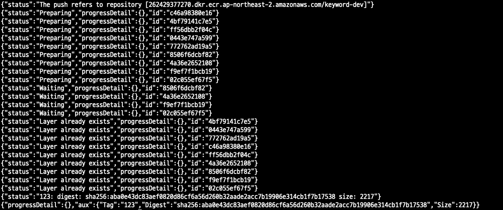

## Docker Image AWS ECR Push using Docker API

1. base64 encoder(실패코드)

```
AUTH=`echo "{ \"username\": \"AWS\", \"password\": \"PW\" }" | base64 --wrap=0`

curl -X POST -d "" -H "X-Registry-Auth: $AUTH" --unix-socket /var/run/docker.sock http://localhost/images/262429377270.dkr.ecr.ap-northeast-2.amazonaws.com/keyword-dev:$TIMESTAMP
```

```
AUTH=`echo "{ \"username\": \"AWS\", \"password\": \"eyJwYXlsb2FkIjoidStMMGdBTjJsbTZGV1N2bm4ycVBmSlNTZS9hYSt4eW9pS0tWYUd1YkxBY2QyQ2UwaG1KTFFyY29hOGpEVnE1WDdlVFA4ekdTK1I1TjlaWHlkdWFEMW9iRi90cE9lajdhR2V2MVNDQUo4VTA0OGFZdVh6QjhlVnVTd05yTXE4WVJTcXJEZjFCbVp3bjZHanlZdEc5bUtNNU50VGJUWERKTFZIaTdaaXlNYlovcUxQT01lQUZnS3hnUXkwSzJMSlVYbEpDemxYZSs4WFkxU0dFdVRxeXpudGExb0dnVVhGMGxEZ3RBSS9idWprOUV0VC9MM1hDaU1ZN3N6cXR6cnJkMVczRHErTDNTOVVyRDhNTmhGVytZdkN0cUY1aFo5LzR4N0p4U2NmQmpNQ053alBlSk91K2dzTkZ3aEhXSEFFSW1UY21Xam1qSHVlNXF1anBmbTRBOEwwSFNjYklkVy9qR2RYcE1zNFRybTNkWmNRVE1IVmhVaURrM2lTT1lpQ2pidTAzT0FPRTkvcGpmNWFaZExPNVhiOWRRS0NCaW5mM1o3TnlVbGlUdmJuNzFETG83Q3NwdlMwNURKZUpackJ4NW5mTzROai9hbnhEcmdOOHNNOVlabWdpRjUyaW1MUG5KY0hKN3ErVkxLeUFUbFlzOFhIdGVTZ0V2czQzb0xqNWhTdnozSXNMWDRYNTN2U282UDltT3VXQ0hYWCtRcXlJaTV4SndOVDZEV1B0d2xwUEZFNjkwR1lrTmxhVFlySzFKWFF4bEUvQU1NVWpaL3Z4VWRvQzV1ZERlRXg4K0R4akx1TkJhMWRNenEzQldZM2NDSEZLdWVoeUtFYjJ0bDVBR3FMTk41T1NldDFzdjczT0hUV0lDcEcrSGwrK1VmdmFoa0tNdFUvNTZHdmgwYVcxL2tkdk0zTUhwVGdqSFdDRDBQQy8rVzIrb1orV1RlTU55RGIrR3BBVFRSMEphNWtqaWJvdUxYM3BQZWVia2N6MnBMUXRJRkdkdjBCVmp1dXVianRONHZpUU9xTkpxaFdOdFJpRHNQOFQ4WHdGbEh5VFJnZGpSdzhDdFY2dmRIZmZTTkllc2h2TVcya2o1K0NTOVlNZFEwRjI2VzdWNXlSWWNSWlJveXFwTUNoamRZd3czUXg2U0RvaGZYSkFvcGg5MEdLcFp4QTFzNE83Z0taYm5BUzQrTG5qVytwWE9EaU1wWDJtc1ByQ3hZdVlYMHVpRFJ0L3V2Sm5PWFIxWDZlOWtpYXgzY2F4SzE5NDhVUUtQdkhJN0xHZ3ZHTlRHcU9JQnNCSHpOdktLNzFjL2czSmdEOVllamVwYjVvRXRQc0l1dHZnRFVMOWVlSFQwYmNudlEzcGRPZzA5Y0QrWFAzV2xKZVJBSVJEdEhGUHhPY1ZpNEI0QTh6anRqTEFpSGNybWFhcjZ4c0FXMUphV1ZDRkJPMElFYm5jbVg0RHBPbjdlOHd6cnVjYnNWYWJyIiwiZGF0YWtleSI6IkFRSUJBSGhBT3NhVzJnWk4wOVdOdE5Ha1ljOHFwMTF4U2haL2RyRUVveTFIazhMWFdnSFFPUGQ5K2pTSjFaeUtxNUU3Lzc0U0FBQUFmakI4QmdrcWhraUc5dzBCQndhZ2J6QnRBZ0VBTUdnR0NTcUdTSWIzRFFFSEFUQWVCZ2xnaGtnQlpRTUVBUzR3RVFRTTlzUTdXWWN5c2syc3NQWkxBZ0VRZ0R1YjYyZ0VUdUlydktNR0pQdFJDa2FBbWhHdnVMVVhOY2ZXenNTcHVuTmk4TEJmbzdEUHFmWW8rNkhlR3ozdW42Z2Y1N0RvMmpEQUo0bUpOdz09IiwidmVyc2lvbiI6IjIiLCJ0eXBlIjoiREFUQV9LRVkiLCJleHBpcmF0aW9uIjoxNjIyNDYzNzYyfQ==\", \"serveraddress\": \"262429377270.dkr.ecr.ap-northeast-2.amazonaws.com\" }" | base64 --wrap=0`

curl -X POST -d "" -H "X-Registry-Auth: $AUTH" --unix-socket /var/run/docker.sock http://localhost/images/myimg:210530_2342/push
```

- Authentication Info.

```
{
  "username": "AWS",
  "password": "pw",
  "email": "kayunkim@plateer.com",
  "serveraddress": "262429377270.dkr.ecr.ap-northeast-2.amazonaws.com"
}
```


1-1. base64 encoder 2(실패코드@_@)

```
registryAuth=$(echo -n '{ "262429377270.dkr.ecr.ap-northeast-2.amazonaws.com": { "username": "AWS", "password": "'$password'", "email": "kayunkim@plateer.com", "serveraddress": "262429377270.dkr.ecr.ap-northeast-2.amazonaws.com" }}'| base64 -w0)
```

```
registryAuth=$(echo -n '{ "262429377270.dkr.ecr.ap-northeast-2.amazonaws.com": { "username": "AWS", "password": "eyJwYXlsb2FkIjoidStMMGdBTjJsbTZGV1N2bm4ycVBmSlNTZS9hYSt4eW9pS0tWYUd1YkxBY2QyQ2UwaG1KTFFyY29hOGpEVnE1WDdlVFA4ekdTK1I1TjlaWHlkdWFEMW9iRi90cE9lajdhR2V2MVNDQUo4VTA0OGFZdVh6QjhlVnVTd05yTXE4WVJTcXJEZjFCbVp3bjZHanlZdEc5bUtNNU50VGJUWERKTFZIaTdaaXlNYlovcUxQT01lQUZnS3hnUXkwSzJMSlVYbEpDemxYZSs4WFkxU0dFdVRxeXpudGExb0dnVVhGMGxEZ3RBSS9idWprOUV0VC9MM1hDaU1ZN3N6cXR6cnJkMVczRHErTDNTOVVyRDhNTmhGVytZdkN0cUY1aFo5LzR4N0p4U2NmQmpNQ053alBlSk91K2dzTkZ3aEhXSEFFSW1UY21Xam1qSHVlNXF1anBmbTRBOEwwSFNjYklkVy9qR2RYcE1zNFRybTNkWmNRVE1IVmhVaURrM2lTT1lpQ2pidTAzT0FPRTkvcGpmNWFaZExPNVhiOWRRS0NCaW5mM1o3TnlVbGlUdmJuNzFETG83Q3NwdlMwNURKZUpackJ4NW5mTzROai9hbnhEcmdOOHNNOVlabWdpRjUyaW1MUG5KY0hKN3ErVkxLeUFUbFlzOFhIdGVTZ0V2czQzb0xqNWhTdnozSXNMWDRYNTN2U282UDltT3VXQ0hYWCtRcXlJaTV4SndOVDZEV1B0d2xwUEZFNjkwR1lrTmxhVFlySzFKWFF4bEUvQU1NVWpaL3Z4VWRvQzV1ZERlRXg4K0R4akx1TkJhMWRNenEzQldZM2NDSEZLdWVoeUtFYjJ0bDVBR3FMTk41T1NldDFzdjczT0hUV0lDcEcrSGwrK1VmdmFoa0tNdFUvNTZHdmgwYVcxL2tkdk0zTUhwVGdqSFdDRDBQQy8rVzIrb1orV1RlTU55RGIrR3BBVFRSMEphNWtqaWJvdUxYM3BQZWVia2N6MnBMUXRJRkdkdjBCVmp1dXVianRONHZpUU9xTkpxaFdOdFJpRHNQOFQ4WHdGbEh5VFJnZGpSdzhDdFY2dmRIZmZTTkllc2h2TVcya2o1K0NTOVlNZFEwRjI2VzdWNXlSWWNSWlJveXFwTUNoamRZd3czUXg2U0RvaGZYSkFvcGg5MEdLcFp4QTFzNE83Z0taYm5BUzQrTG5qVytwWE9EaU1wWDJtc1ByQ3hZdVlYMHVpRFJ0L3V2Sm5PWFIxWDZlOWtpYXgzY2F4SzE5NDhVUUtQdkhJN0xHZ3ZHTlRHcU9JQnNCSHpOdktLNzFjL2czSmdEOVllamVwYjVvRXRQc0l1dHZnRFVMOWVlSFQwYmNudlEzcGRPZzA5Y0QrWFAzV2xKZVJBSVJEdEhGUHhPY1ZpNEI0QTh6anRqTEFpSGNybWFhcjZ4c0FXMUphV1ZDRkJPMElFYm5jbVg0RHBPbjdlOHd6cnVjYnNWYWJyIiwiZGF0YWtleSI6IkFRSUJBSGhBT3NhVzJnWk4wOVdOdE5Ha1ljOHFwMTF4U2haL2RyRUVveTFIazhMWFdnSFFPUGQ5K2pTSjFaeUtxNUU3Lzc0U0FBQUFmakI4QmdrcWhraUc5dzBCQndhZ2J6QnRBZ0VBTUdnR0NTcUdTSWIzRFFFSEFUQWVCZ2xnaGtnQlpRTUVBUzR3RVFRTTlzUTdXWWN5c2syc3NQWkxBZ0VRZ0R1YjYyZ0VUdUlydktNR0pQdFJDa2FBbWhHdnVMVVhOY2ZXenNTcHVuTmk4TEJmbzdEUHFmWW8rNkhlR3ozdW42Z2Y1N0RvMmpEQUo0bUpOdz09IiwidmVyc2lvbiI6IjIiLCJ0eXBlIjoiREFUQV9LRVkiLCJleHBpcmF0aW9uIjoxNjIyNDYzNzYyfQ==", "email": "kayunkim@plateer.com", "serveraddress": "262429377270.dkr.ecr.ap-northeast-2.amazonaws.com" }}'| base64 -w0)

```

- curl 명령어

```
curl -X POST -H "X-Registry-Auth: $registryAuth" --unix-socket /var/run/docker.sock http://localhost/images/262429377270.dkr.ecr.ap-northeast-2.amazonaws.com/keyword-dev:123/push
```


2. Authorization-token(실패코드)

```
TOKEN=$(aws ecr get-authorization-token --output text --query 'authorizationData[].authorizationToken')

curl -X POST -H "Authorization: Basic $TOKEN" --unix-socket /var/run/docker.sock http://localhost/images/262429377270.dkr.ecr.ap-northeast-2.amazonaws.com/keyword-dev:$TIMESTAMP/push

or

curl -X POST -H "X-Registry-Auth:$TOKEN" --unix-socket /var/run/docker.sock  http://localhost/images/262429377270.dkr.ecr.ap-northeast-2.amazonaws.com/keyword-dev:$TIMESTAMP/push
```


3. Identity Token

- Empty Token Return Value

- Short-lived Tokens

> https://github.com/moby/moby/issues/38830

> https://github.com/moby/moby/issues/33429

```
# pw 출력하기
$ aws ecr get-login-password --region ap-northeast-2
```

```
curl --unix-socket /var/run/docker.sock -X POST http://localhost/auth --data '{"username": "AWS", "password": "eyJwYXlsb2FkIjoidStMMGdBTjJsbTZGV1N2bm4ycVBmSlNTZS9hYSt4eW9pS0tWYUd1YkxBY2QyQ2UwaG1KTFFyY29hOGpEVnE1WDdlVFA4ekdTK1I1TjlaWHlkdWFEMW9iRi90cE9lajdhR2V2MVNDQUo4VTA0OGFZdVh6QjhlVnVTd05yTXE4WVJTcXJEZjFCbVp3bjZHanlZdEc5bUtNNU50VGJUWERKTFZIaTdaaXlNYlovcUxQT01lQUZnS3hnUXkwSzJMSlVYbEpDemxYZSs4WFkxU0dFdVRxeXpudGExb0dnVVhGMGxEZ3RBSS9idWprOUV0VC9MM1hDaU1ZN3N6cXR6cnJkMVczRHErTDNTOVVyRDhNTmhGVytZdkN0cUY1aFo5LzR4N0p4U2NmQmpNQ053alBlSk91K2dzTkZ3aEhXSEFFSW1UY21Xam1qSHVlNXF1anBmbTRBOEwwSFNjYklkVy9qR2RYcE1zNFRybTNkWmNRVE1IVmhVaURrM2lTT1lpQ2pidTAzT0FPRTkvcGpmNWFaZExPNVhiOWRRS0NCaW5mM1o3TnlVbGlUdmJuNzFETG83Q3NwdlMwNURKZUpackJ4NW5mTzROai9hbnhEcmdOOHNNOVlabWdpRjUyaW1MUG5KY0hKN3ErVkxLeUFUbFlzOFhIdGVTZ0V2czQzb0xqNWhTdnozSXNMWDRYNTN2U282UDltT3VXQ0hYWCtRcXlJaTV4SndOVDZEV1B0d2xwUEZFNjkwR1lrTmxhVFlySzFKWFF4bEUvQU1NVWpaL3Z4VWRvQzV1ZERlRXg4K0R4akx1TkJhMWRNenEzQldZM2NDSEZLdWVoeUtFYjJ0bDVBR3FMTk41T1NldDFzdjczT0hUV0lDcEcrSGwrK1VmdmFoa0tNdFUvNTZHdmgwYVcxL2tkdk0zTUhwVGdqSFdDRDBQQy8rVzIrb1orV1RlTU55RGIrR3BBVFRSMEphNWtqaWJvdUxYM3BQZWVia2N6MnBMUXRJRkdkdjBCVmp1dXVianRONHZpUU9xTkpxaFdOdFJpRHNQOFQ4WHdGbEh5VFJnZGpSdzhDdFY2dmRIZmZTTkllc2h2TVcya2o1K0NTOVlNZFEwRjI2VzdWNXlSWWNSWlJveXFwTUNoamRZd3czUXg2U0RvaGZYSkFvcGg5MEdLcFp4QTFzNE83Z0taYm5BUzQrTG5qVytwWE9EaU1wWDJtc1ByQ3hZdVlYMHVpRFJ0L3V2Sm5PWFIxWDZlOWtpYXgzY2F4SzE5NDhVUUtQdkhJN0xHZ3ZHTlRHcU9JQnNCSHpOdktLNzFjL2czSmdEOVllamVwYjVvRXRQc0l1dHZnRFVMOWVlSFQwYmNudlEzcGRPZzA5Y0QrWFAzV2xKZVJBSVJEdEhGUHhPY1ZpNEI0QTh6anRqTEFpSGNybWFhcjZ4c0FXMUphV1ZDRkJPMElFYm5jbVg0RHBPbjdlOHd6cnVjYnNWYWJyIiwiZGF0YWtleSI6IkFRSUJBSGhBT3NhVzJnWk4wOVdOdE5Ha1ljOHFwMTF4U2haL2RyRUVveTFIazhMWFdnSFFPUGQ5K2pTSjFaeUtxNUU3Lzc0U0FBQUFmakI4QmdrcWhraUc5dzBCQndhZ2J6QnRBZ0VBTUdnR0NTcUdTSWIzRFFFSEFUQWVCZ2xnaGtnQlpRTUVBUzR3RVFRTTlzUTdXWWN5c2syc3NQWkxBZ0VRZ0R1YjYyZ0VUdUlydktNR0pQdFJDa2FBbWhHdnVMVVhOY2ZXenNTcHVuTmk4TEJmbzdEUHFmWW8rNkhlR3ozdW42Z2Y1N0RvMmpEQUo0bUpOdz09IiwidmVyc2lvbiI6IjIiLCJ0eXBlIjoiREFUQV9LRVkiLCJleHBpcmF0aW9uIjoxNjIyNDYzNzYyfQ==", "serveraddress": "262429377270.dkr.ecr.ap-northeast-2.amazonaws.com"}'
```

```
# Identity Token Output
{"IdentityToken":"","Status":"Login Succeeded"}
```


4. JSON > base64> base64 url convert(SUCCESS!!)

```
# echo Some_data_to_be_converted | base64 | sed 's/+/-/g; s/\//_/g';
```

```
$ echo '{ "username":"AWS", "password":"{pw}", "email": "kayunkim@plateer.com", "serveraddress":"262429377270.dkr.ecr.ap-northeast-2.amazonaws.com" }' | base64 -w 0 | sed 's/+/-/g; s/\//_/g'
```

```
curl -X POST -H "X-Registry-Auth:{return value}" --unix-socket /var/run/docker.sock http://localhost/images/262429377270.dkr.ecr.ap-northeast-2.amazonaws.com/keyword-dev:123/push
```




> https://stackoverflow.com/questions/58957358/how-to-encode-and-decode-data-in-base64-and-base64url-by-using-unix-commands

