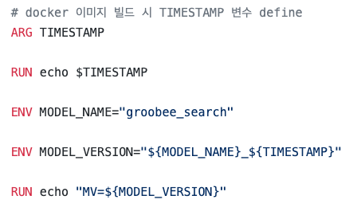
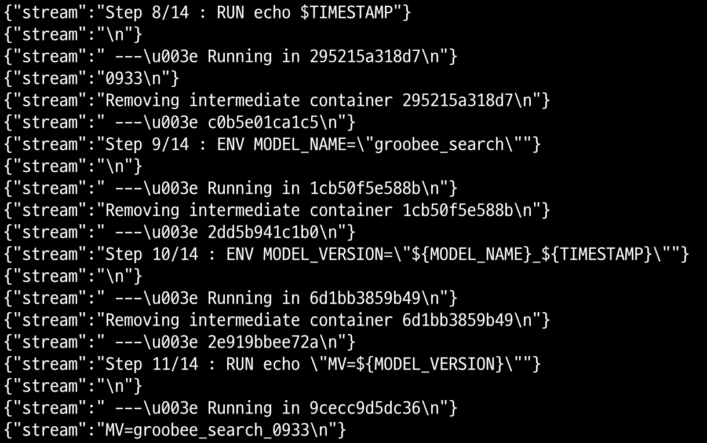
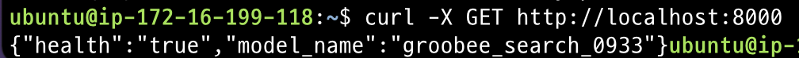

```
# docker 이미지 빌드 시 TIMESTAMP 변수 define
ARG TIMESTAMP

RUN echo $TIMESTAMP

ENV MODEL_NAME="groobee_search"

ENV MODEL_VERSION="${MODEL_NAME}_${TIMESTAMP}"

RUN echo "MV=${MODEL_VERSION}"
```





```
$  docker run -d -p 8000:8000 {IMAGE ID}
```

```
$ curl -X GET http://localhost:8000
```

