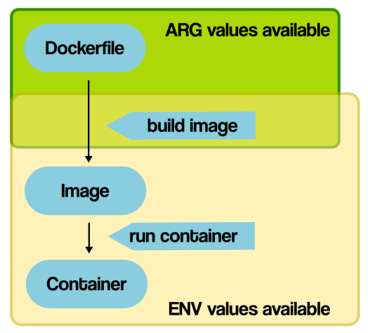

### 환경변수 생성

`ARG`

- AKA "build-time variables"
- Docker 이미지를 build할 때(RUN) 환경 변수 생성
- Dockerfile에서 ARG로 정의된 순간부터 이미지 빌드되는 시점까지 사용됨.
- 컨테이너 실행 시에는 ARG 변수 접근 불가
- Dockerfile에서 ARG 값을 default로 주지 않고, build 명령어에 값을 지정하지 않으면 에러 발생함
- 해당 default 값이 있다면, build 명령 시 ARG 값으로 대체됨


`ENV`

- Build 단계에서 참조 가능(ARG를 ENV에 pass하는 경우 등)
- Docker 컨테이너를 실행할 때(ENTRYPOINT, CMD) 환경 변수 전달 및 덮어쓰기 가능

```bash
# expect a build-time variable(이미지 빌드 시 --build-arg 파라미터로 변수 값 전달하기)
ARG SOME_VALUE

# set default ENV value from ARG
ENV env_var=$SOME_VALUE
# if not overridden, that value of env_var will be available to your containers!
$ docker run -e "env_var=another_value" alpine env
```




reference

>  https://vsupalov.com/docker-build-time-env-values/

>  https://vsupalov.com/docker-arg-env-variable-guide/

>  https://github.com/heowc/programming-study/issues/90


`EXPORT`

- Dockerfile에 RUN EXPORT로 변수를 설정하면, 변수가 유지 되지 않음

```bash
FROM centos:6

# variable persist
ENV FOO=foofoo

# variable not persist
RUN export BAR=barbar

RUN export BAZ=bazbaz && echo "$FOO $BAR $BAZ"
Step 4/4 : RUN export BAZ=bazbaz && echo "$FOO $BAR $BAZ"
 ---> Running in eb66196b238d
foofoo  bazbaz
```

reference

>  https://stackoverflow.com/questions/33379393/docker-env-vs-run-export


`.env`

- (같은 경로에 위치한)docker-compose.yml 파일에서 사용할 환경 변수 정의
- Dockerfile 명령어와는 관련 없고 docker-compose에서만 사용됨!

```bash
# .env
VARIABLE_NAME=some value
# docker-compose.yml
version: '3'

services:
  plex:
    image: linuxserver/plex
      environment:
        - env_var_name=${VARIABLE_NAME} # here it is
```

*환경변수 적용을 확인하고 싶으면 docker-compose config로 가능

