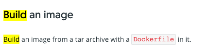

### 0. 진행 배경

- 검색어 추천 학습을 위한 버전관리(새 고객사 추가 이후 데이터 반영, 기존 고객사 데이터 업데이트 등) 파이프라인 구축 필요
- 처음 목표했던 점은 `keyword DAG` 에서 1) 데이터 전처리, 학습 진행 후 S3 업로드와 2) 학습 결과 데이터를 바탕으로 docker 이미지 빌드 후 3) ECR에 Push하여 4) ECS에서 최신 이미지를 Pull 받아 추천 컨테이너 돌리기⇒ 추천 API 응답 확인


### 1. Dockerfile 작성

👉 검색어 추천 학습을 마치고 해당 버전을 구분할 수 있는 TIMESTAMP(날짜_시간) 태그를 달아서 docker 이미지 빌드 후 ECR에 이미지 Push 하기위한 Dockerfile 작성

```
FROM --platform=linux/amd64 python:3.7-slim-buster

RUN apt-get update && apt-get install -y --no-install-recommends \
    apt-utils \
    tree \
    net-tools \
    curl \
    unzip \
    cron \
    vim \
    && rm -rf /var/lib/apt/lists/*

# docker 내 keyword_code 폴더 생성
RUN mkdir /keyword_code

# docker 내에서 코드 실행할 위치 설정
WORKDIR /keyword_code

# 모든 코드들 docker 실행 폴더 위치에 복사하기
COPY . /keyword_code

# 이미지 생성 과정 중 명령어 실행(필요 라이브러리 설치) 
RUN pip install -r requirements.txt

# docker 이미지 빌드 시 TIMESTAMP 변수 define
ARG TIMESTAMP

ENV MODEL_NAME="gs"

ENV MODEL_VERSION="${MODEL_NAME}_${TIMESTAMP}"

# FastAPI 8000번 포트 열기
EXPOSE 8000

# set locale
ENV LC_ALL=C.UTF-8

# 컨테이너 실행
CMD python3 app.py --aws-conf=aws --model-conf=model --model-version=$MODEL_VERSION
```


👉 CLI 명령어

```
$ docker build -t keyword:`date +%y%m%d%H%M` --build-arg TIMESTAMP=`date +%y%m%d%H%M` .
```


### 2. Docker API 

- Local에서는 dockerfile을 사용하여 수동으로 이미지 빌드 및 컨테이너 정상 실행 확인
- But, 현재 이 dockerfile은 ` EC2`안에 컨테이너로 띄워져 있는 `keyword DAG` 의 keyword라는 Queue를 바라보는 `airflow worker` 내부에 있음
- 따라서 학습 후 이미지를 빌드하기 위해서는 컨테이너 안에서 docker를 실행해야 했지만, 내부에 docker가 설치되어 있지 않아 docker 명령어를 칠 수 없다는 **문제 발생**
- **해결방안:**
  1. 수동으로 docker를 설치할 수 있지만, 자동화 방안을 찾고 싶었음
  2. 컨테이너를 띄울 때 Dockerfile에 docker 설치 명령어를 추가할 수 있지만, 초기 Dockerfile이 없고 ECR에 이미지만 올라가있는 상태
  3. Dockerfile을 복원할 수도 있지만, 이후 task로 남기고 일단 docker in docker 방안을 찾아보기로 함
- 따라서 docker 내부에서 docker를 실행할 수 있는 docker in docker를 찾아본 결과 docker API 기능을 사용하기로 결정함
- docker API는 docker container가 실행되고 있는 host에 docker 명령어를 전달하여 docker container 내부에서 docker를 동일하게 사용할 수 있게 함


#### 2-1) host container 실행

👉 bind-mounting 적용: docker API를 사용하기 위해서는 host container를 띄울 때 아래 명령어 실행

```
$ docker run -v /var/run/docker.sock:/var/run/docker.sock ...
```

컨테이너 정상 실행 후 /var/run 경로에 docker.sock 이 있는 것을 확인할 수 있음


#### 2-2) curl 명령어

> https://docs.docker.com/engine/api/v1.41/#operation/ImageBuild

> https://docs.docker.com/engine/api/sdk/examples/

- Request는 POST로
- --unix-socket으로 docker.sock 활용
- URL 주소 뒤 /build 

```
$ curl -X POST --unix-socket /var/run/docker.sock http://localhost/build
```

```
# 에러메시지

{"message":"Cannot locate specified Dockerfile: Dockerfile"}
```


#### 2-3) 이미지 빌드 시 필요한 파일들 압축하기

- [공식문서](https://docs.docker.com/engine/api/v1.41/#operation/ImageBuild)에 보면 이미지를 빌드하기 위해서는 Dockerfile을 압축하여 넘겨주어야 함



- 또한 Dockerfile 내부 코드 중 모든 파일코드들 COPY와 requirements.txt를 바탕으로 모듈 설치 명령어가 있기 때문에, 필요한 모든 파일 및 폴더도 함께 압축해주어야 함!

```
$ tar -cvf Dockerfile.tar.gz Dockerfile requirements.txt app.py ...
```

```
$ curl -X POST -H "Content-Type:application/tar" --data-binary '@Dockerfile.tar.gz' --unix-socket /var/run/docker.sock http://localhost/build
```


#### 2-4) 이미지 빌드 시 Parameter 추가 및 URI component encode 변환하기

- 이미지 빌드할 때 버전관리를 위한 TIMESTAMP 변수를 이미지 태그로하는 buildargs 파라미터 추가하기
- 파라미터 추가 양식(?파라미터1=값&파라미터2=값)

```
$ curl -X POST -H "Content-Type:application/tar" --unix-socket /var/run/docker.sock "http://localhost/build?t=keyword:0515_1500&buildargs={"TIMESTAMP":0515_1500"}
```

- 해당 명령어를 치면 에러 발생⇒ 공식문서에 보면 buildargs 파라미터 URI component encoded 양식으로 변환 권장

> https://onlinejsontools.com/url-encode-json

```
$ curl -X POST -H "Content-Type:application/tar" --unix-socket /var/run/docker.sock "http://localhost/build?t=keyword:0515_1500&buildargs=%7B%22TIMESTAMP%22%3A0515_1500%22%7D
```


### 3. Image build  자동화를 위한 Airflow Task 및 Shell Script 작성하기

👉 이미지 빌드를 위한 파일 압축, 빌드 명령어를 자동화하기 위해 Shell Script에 작성하고, 해당 스크립트를 실행하기 위한 Task를 Airflow DAG에 추가하기

#### 3-1) Airflow Task 작성

- Image build Shell Script를 실행하기 위한 Airflow Task를 작성하여 DAG로 돌리기

```
current_dag_run_time = "{{ task_instance.xcom_pull('get_current_dag_run_time', key='return_value') }}"
...

build_docker_image = BashOperator(
    task_id = 'build_docker_image',
    bash_command = "cd /data/KEYWORD_TRAIN && source build_docker_image.sh {}".format(current_dag_run_time),
    queue = "keyword_train",
    dag = dag
)
```

- 해당 Task 실행 시 bash_command로 `current_dag_run_time` 이 Shell Script에 첫번째 인자 값으로 전달되어 TIMESTAMP를 정의할 수 있음.


#### 3-2) Shell Script 작성

👉 Docker 이미지 빌드를 위한 cmd 명령어를 자동화 하기 위해 관련 명령어들 shell script에 작성

```
buildargs={"TIMESTAMP":"${TIMESTAMP}"}
```

```
# Image Build 시 필요한 파일들 압축
tar -cvf Dockerfile.tar.gz Dockerfile requirements.txt app.py ...

# CLI 명령어 첫번째 전달 파라미터 -> $1
# Image TAG Name from Airflow DAG(current_dag_run_time)
TIMESTAMP=$1

CMD="curl -X POST -H \"Content-Type:application/tar\" --data-binary \"@Dockerfile.tar.gz\" --unix-socket /var/run/docker.sock \"http://localhost/build?t={amazonaws.com}/keyword-dev:${TIMESTAMP}&buildargs=%7B%22TIMESTAMP%22%3A%22${TIMESTAMP}%22%7D\""

# Evaluate(execute) CMD in CLI
eval $CMD
```


### 4. ECR Image push 자동화를 위한 Shell Script 작성하기

👉 docker 이미지 Push 명령어도 자동으로 수행하기 Shell Script를 작성하고 Airflow DAG에 Task 추가하기

> https://docs.docker.com/engine/api/v1.41/#operation/ImagePush

> https://docs.docker.com/engine/api/v1.41/#section/Authentication


- ECR에 Push하기 위한 로그인 계정 등록
- Header parameter에  X-Registry-Auth 추가하기
- 코드 변환 필요

> https://simplycalc.com/base64url-encode.php

> https://stackoverflow.com/questions/58957358/how-to-encode-and-decode-data-in-base64-and-base64url-by-using-unix-commands

```
AUTH=$(echo '{ "username":"AWS", "password":"'$PW'", "email": "email@address", "serveraddress":"'$ECR_ADDRESS'" }' | base64 -w 0 | sed 's/+/-/g; s/\//_/g')
```

- docker image push shell script

```
# Image TAG Name from Airflow DAG(current_dag_run_time)
TIMESTAMP=$1

# Get Password
PW=$(aws ecr get-login-password --region ap-northeast-2)

# Get ECR Address
ECR_ADDRESS="amazonaws.com"

# Generate Auth JSON => base64 => base64 url
AUTH=$(echo '{ "username":"AWS", "password":"'$PW'", "email": "email@address", "serveraddress":"'$ECR_ADDRESS'" }' | base64 -w 0 | sed 's/+/-/g; s/\//_/g')

# ECR push Image curl command
curl -X POST -H "X-Registry-Auth:$AUTH" --unix-socket /var/run/docker.sock http://localhost/images/$ECR_ADDRESS/keyword-dev:$TIMESTAMP/push
```


### 5. Airflow Dag Task 추가

👉 위 과정을 Airflow로 자동화 하기 위해 Task를 추가 후 DAG로 실행하기

```
with DAG(dag_name, default_args=default_args, schedule_interval='0 */24 * * *') as dag:
    # Task
    get_current_dag_run_time = PythonOperator(
        task_id='get_current_dag_run_time',
        queue="keyword_train",
        python_callable=get_current_dag_run_time,
        op_kwargs={'dag': dag},
        dag=dag
    )

    current_dag_run_time = "{{ task_instance.xcom_pull('get_current_dag_run_time', key='return_value') }}"
...

build_docker_image = BashOperator(
    task_id = 'build_docker_image',
    bash_command = "cd /data/KEYWORD_TRAIN && source build_docker_image.sh {}".format(current_dag_run_time),
    queue = "keyword_train",
    dag = dag
    )

push_docker_image = BashOperator(
    task_id = 'push_docker_image',
    bash_command = "cd /data/KEYWORD_TRAIN && source push_docker_image.sh {}".format(current_dag_run_time),
    queue = "keyword_train",
    dag = dag
    )
...
 
get_current_dag_run_time >> ... >> build_docker_image >> push_docker_image >> ... 
```

