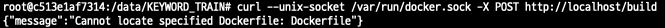
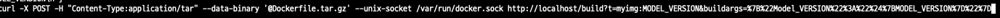

### 하고 싶은 것

Keyword_product Ec2 Docker container 안에서 도커이미지 빌드 후 ECR Push하기


### 문제점

Docker container 안에서 Docker 실행할 수 없음

1. Docker socket(docker.sock) => $PATH를 찾을 수 없음

   ```
   $ alias dfimage="docker run -v /var/run/docker.sock:/var/run/docker.sock --rm {img name}"
   ```

   ```
   $ dfimage {img ID}
   ```

   ```
   docker: Error response from daemon: OCI runtime create failed: container_linux.go:349: starting container process caused "exec: \"fe34\": executable file not found in $PATH": unknown.
   ```

   ``` 
   # Dockerfile
   CMD ["fe34"]  => CMD fe34
   ```


2. container 안에서 Docker 수동 설치

3. container 띄우는 이미지에 docker 설치 명령어 추가하기
   - 이미지 빌드를 위한 Dockerfile 수정 필요 => 존재하지 않음
4. 현재 docker image를 사용하여 실행하는 Container에서 docker 없이 이미지 빌드하기(Docker in Docker)
   1. Buildah & Podman
   2. Kaniko
   3. Bazel
   4. **Docker API**
   
   

## 해결방안

- Docker API

```
 $ curl --unix-socket /var/run/docker.sock http://localhost/build
```

```
{"message":"page not found"}
```


```
 $ curl -X POST --unix-socket /var/run/docker.sock http://localhost/build
```

```
{"message":"Cannot locate specified Dockerfile: Dockerfile"}
```




*Dockerfile tar파일로 압축하기*

```
$ tar -cvf Dockerfile.tar.gz Dockerfile 
```

*Dockerfile tar파일로 이미지 Build하기*

```
$ curl -X POST -H "Content-Type:application/tar" --data-binary '@Dockerfile.tar.gz' --unix-socket /var/run/docker.sock http://localhost/build
```




## 최종

1. Bastion> groobeeds> mycon container bash
2. ImageBuild.sh 작성하기

```
# ImageBuild.sh 파일 생성
$ vi.ImageBuild.sh

# ImageBuild.sh 코드 작성
CMD="curl -X POST -H 'Content-Type:application/tar' --data-binary '@Dockerfile.tar.gz' --unix-socket /var/run/docker.sock http://localhost/build?t=myimg:$TIMESTAMP&buildargs=$TIMESTAMP"

or

CMD='curl -X POST -H "Content-Type:application/tar" --data-binary "@Dockerfile.tar.gz" --unix-socket /var/run/docker.sock http://localhost/build?t=myimg:$TIMESTAMP&buildargs=$TIMESTAMP'

# ImageBuild.sh (새로고침/적용)실행하기
$ source ImageBuild.sh
```


- 실패코드

```
CMD='curl -X POST -H \"Content-Type:application/tar\" --data-binary \"@Dockerfile.tar.gz\" --unix-socket /var/run/docker.sock http://localhost/build?t=myimg:$TIMESTAMP&buildargs=$TIMESTAMP'

# 정상코드
CMD="curl -X POST -H \"Content-Type:application/tar\" --data-binary \"@Dockerfile.tar.gz\" --unix-socket /var/run/docker.sock http://localhost/build?t=myimg:$TIMESTAMP&buildargs=$TIMESTAMP"
```

