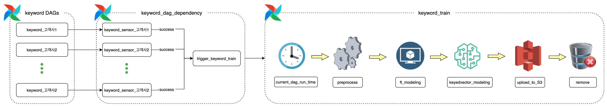
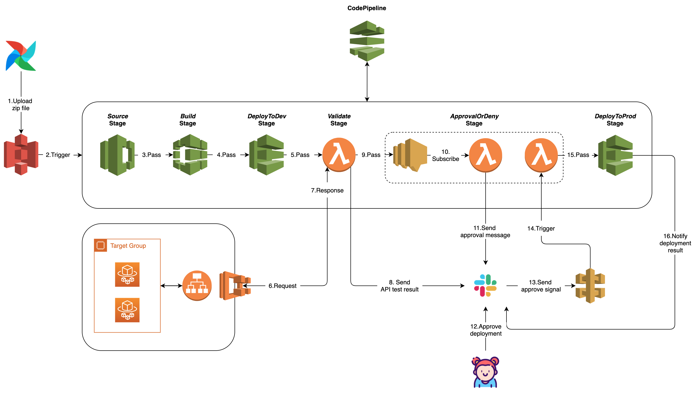

## ML 모델 CD 자동화 파이프라인 구축

### 검색어 추천(FastText) 모델 학습 Airflow DAG 

1. 각 고객사 검색어 학습(keyword DAGs)이 완료되면 
2. sensor DAG(keyword_dag_dependency)가 센싱하고 있다가 
3. keyword_train DAG를 trigger함

### AWS CodePipeline 배포 아키텍처

1. keyword_train DAG에서 학습 후 docker image 빌드 및 FastAPI 컨테이너를 띄우기 위해 필요한 모든 파일을 `ds-model/FT/latest/latest.zip`에 업로드
2. codepipeline은 `ds-model/FT/latest/latest.zip`을 센싱하고 있다가 변경 사항이 감지되면 trigger
3. Source stage
   - `ds-model/FT/latest/latest.zip`를 build stage로 전달
4. Build stage
   - latest.zip을 압축 해제하고 docker image build 및 ECR에 해당 이미지 push
5. DeployToDev stage
   - ECR에서 해당 docker 이미지를 pull 하고 해당 이미지로 `검색어추천` 개발 서비스 업데이트(배포)
6. Validate stage
   - `검색어추천` 개발 서비스 로드밸런서에 serviceKey별 keyword를 request하고 해당 추천 결과를 받아서 slack `search_deploy` channel에 전송
7. ApprovalOrDeny
   - `검색어추천` 운영 서비스에 새로운 버전의 도커 이미지에 대한 배포 여부 승인
   - 승인을 하면 다음 stage로 넘어가고, 승인하지 않으면 해당 codepipeline은 fail 처리되어 종료됨
8. DeployToProd stage
   - `검색어추천` 운영 서비스에 새로운 버전의 도커 이미지 배포
